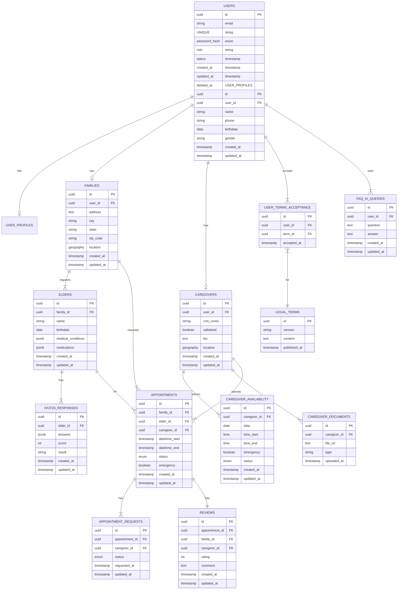

```mermaid
erDiagram
USERS ||--o| USER_PROFILES : "has"
USERS ||--o| FAMILIES : "has"
USERS ||--o| CAREGIVERS : "has"
USERS ||--|{ USER_TERMS_ACCEPTANCE : "accepts"
USER_TERMS_ACCEPTANCE }|--|| LEGAL_TERMS : "for"
FAMILIES ||--|{ ELDERS : "registers"
ELDERS ||--|{ IVCF20_RESPONSES : "has"
CAREGIVERS ||--|{ CAREGIVER_AVAILABILITY : "defines"
CAREGIVERS ||--|{ CAREGIVER_DOCUMENTS : "uploads"
FAMILIES ||--|{ APPOINTMENTS : "requests"
ELDERS ||--|{ APPOINTMENTS : "for"
CAREGIVERS ||--|{ APPOINTMENTS : "attends"
APPOINTMENTS ||--|{ APPOINTMENT_REQUESTS : "has"
APPOINTMENTS ||--|| REVIEWS : "has"
USERS ||--|{ FAQ_AI_QUERIES : "asks"

    USERS {
        uuid id PK
        string email UNIQUE
        string password_hash
        enum role
        string status
        timestamp created_at
        timestamp updated_at
        timestamp deleted_at


    USER_PROFILES
        uuid id PK
        uuid user_id FK
        string name
        string phone
        date birthdate
        string gender
        timestamp created_at
        timestamp updated_at
    }

    LEGAL_TERMS {
        uuid id PK
        string version
        text content
        timestamp published_at
    }

    USER_TERMS_ACCEPTANCE {
        uuid id PK
        uuid user_id FK
        uuid term_id FK
        timestamp accepted_at
    }

    FAMILIES {
        uuid id PK
        uuid user_id FK
        text address
        string city
        string state
        string zip_code
        geography location
        timestamp created_at
        timestamp updated_at
    }

    ELDERS {
        uuid id PK
        uuid family_id FK
        string name
        date birthdate
        jsonb medical_conditions
        jsonb medications
        timestamp created_at
        timestamp updated_at
    }

    IVCF20_RESPONSES {
        uuid id PK
        uuid elder_id FK
        jsonb answers
        int score
        string result
        timestamp created_at
        timestamp updated_at
    }

    CAREGIVERS {
        uuid id PK
        uuid user_id FK
        string crm_coren
        boolean validated
        text bio
        geography location
        timestamp created_at
        timestamp updated_at
    }

    CAREGIVER_AVAILABILITY {
        uuid id PK
        uuid caregiver_id FK
        date date
        time time_start
        time time_end
        boolean emergency
        enum status
        timestamp created_at
        timestamp updated_at
    }

    CAREGIVER_DOCUMENTS {
        uuid id PK
        uuid caregiver_id FK
        text file_url
        string type
        timestamp uploaded_at
    }

    APPOINTMENTS {
        uuid id PK
        uuid family_id FK
        uuid elder_id FK
        uuid caregiver_id FK
        timestamp datetime_start
        timestamp datetime_end
        enum status
        boolean emergency
        timestamp created_at
        timestamp updated_at
    }

    APPOINTMENT_REQUESTS {
        uuid id PK
        uuid appointment_id FK
        uuid caregiver_id FK
        enum status
        timestamp requested_at
        timestamp updated_at
    }

    REVIEWS {
        uuid id PK
        uuid appointment_id FK
        uuid family_id FK
        uuid caregiver_id FK
        int rating
        text comment
        timestamp created_at
        timestamp updated_at
    }

    FAQ_AI_QUERIES {
        uuid id PK
        uuid user_id FK
        text question
        text answer
        timestamp created_at
        timestamp updated_at
    }
```
